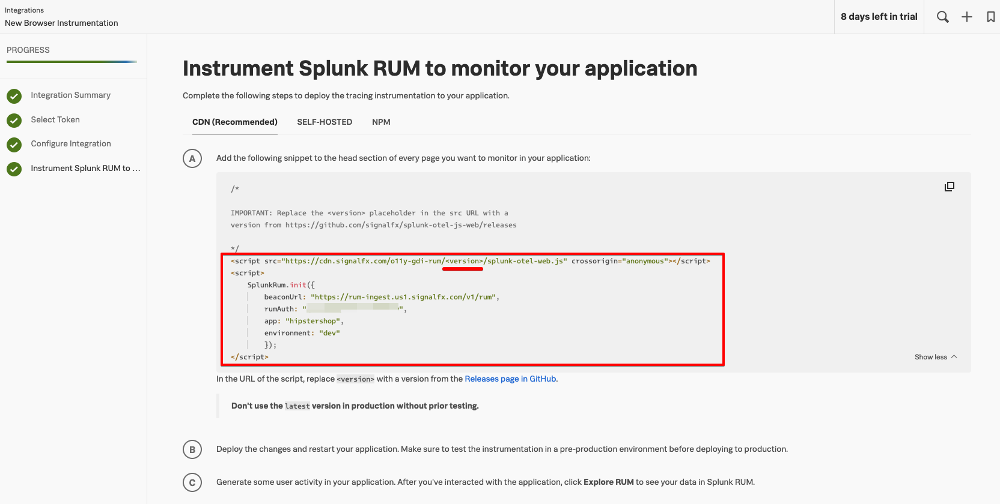
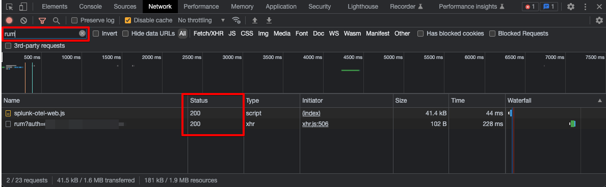

## RUM Testing with Splunk Observability Cloud

### Steps
1. Create RUM access token in Splunk o11y Cloud<br/>
Refer to https://docs.splunk.com/Observability/rum/set-up-rum.html#generate-your-rum-access-token-in-observability-cloud


2. Instruction on Browser-based web application instrumentation<br/>
Refer to https://docs.splunk.com/Observability/gdi/get-data-in/rum/browser/get-browser-data-in.html#get-started-splunk-rum-browser



Note: Remember to replace the "<version>" tag in the URL with relevant version. For ease of testing, you may use "latest" tag.


3. Create Kind Cluster
```
kind create cluster --name rum-testing --config=kind-cluster.yaml
```

4. Deploy Hipstershop
```
kubectl apply -f hipstershop.yaml
```

5. Deploy Ingress Cntroller. In this example we use NGINX Ingress Controller
```
kubectl apply -f https://raw.githubusercontent.com/kubernetes/ingress-nginx/main/deploy/static/provider/kind/deploy.yaml 
```

6. Ensure all the pods are running
```
kubectl get pods --all-namespaces
```

7. Update Ingress file<br/>
Edit the hipstershop-ingress.yaml, update the info taken from Step 2 above.
```
      sub_filter '</head>' '<script src="https://cdn.signalfx.com/o11y-gdi-rum/latest/splunk-otel-web.js" crossorigin="anonymous"></script>
        <script>
          SplunkRum.init({
          beaconUrl: "https://rum-ingest.us1.signalfx.com/v1/rum",
          rumAuth: "<redacted>",
          app: "hipstershop",
          environment: "dev"
        });
        </script></head>';
```


8. Deploy Ingress resource
```
#In this ingress resource, we do not specify host name for ease fo testing. In production, you are likely to use appropriate host name
kubectl apply -f hipstershop-ingress.yaml
```

9. Browse the hipsstershop app
Open browser and visit to https://localhost Perform and browsing to generate some test data


10. Visit Splunk RUM to monitor the incoming metrics


11. Once done testing, delete the k8s Kind cluster
```
kind delete cluster --name rum-testing
```

### Troubleshooting:
To make sure the Splunk RUM instrumentation works prooperly, open Developer Tools in browser, in Network tab filter the output by "rum". Ensure the Javascript download is status 200 and API call to RUM is 200
