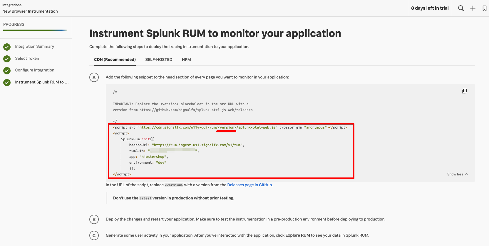
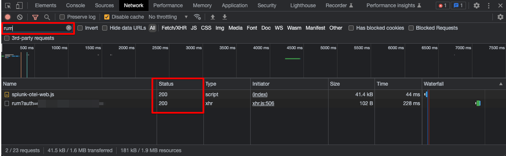

## RUM Testing with Splunk Observability Cloud - Injection with NGINX Proxy

### Steps
1. Create RUM access token in Splunk o11y Cloud<br/>
Refer to https://docs.splunk.com/Observability/rum/set-up-rum.html#generate-your-rum-access-token-in-observability-cloud


2. Instruction on Browser-based web application instrumentation<br/>
Refer to https://docs.splunk.com/Observability/gdi/get-data-in/rum/browser/get-browser-data-in.html#get-started-splunk-rum-browser



Note: Remember to replace the "<version>" tag in the URL with relevant version. For ease of testing, you may use "latest" tag.


3. Update default.conf file
In the conf.d/default.conf, update the rumAuth info taken from Step 2 above.


3. Create the deployment
```
docker-compose -f docker-compose.yaml up -d
```

9. Browse the juiceshop app
Open browser and visit to http://localhost Perform and browsing to generate some test data


10. Visit Splunk RUM to monitor the incoming metrics


11. Once done testing, delete the k8s Kind cluster
```
docker-compose -f docker-compose.yaml  down
```

### Troubleshooting:
To make sure the Splunk RUM instrumentation works prooperly, open Developer Tools in browser, in Network tab filter the output by "rum". Ensure the Javascript download is status 200 and API call to RUM is 200
